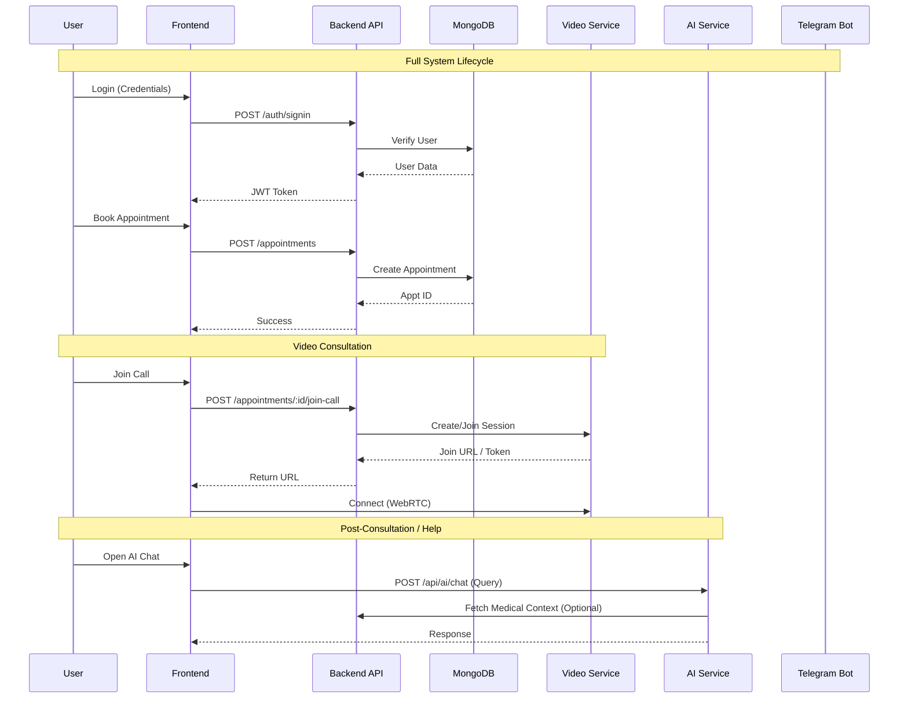
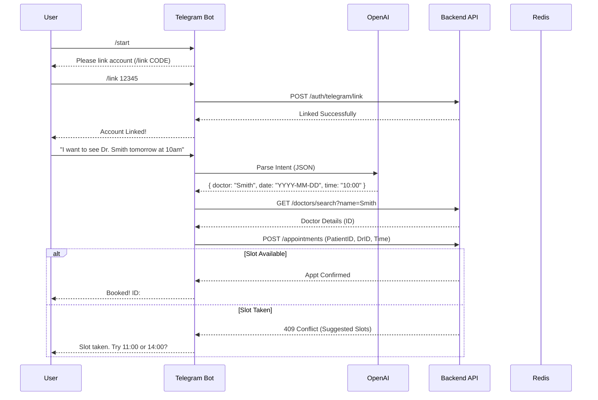
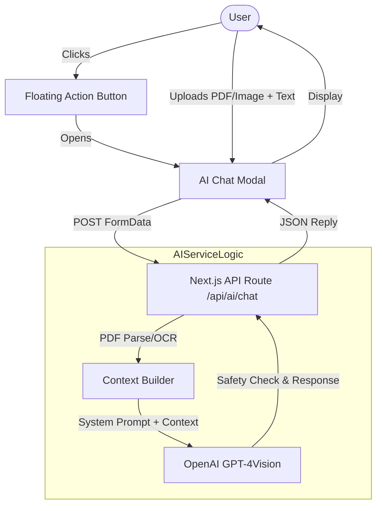
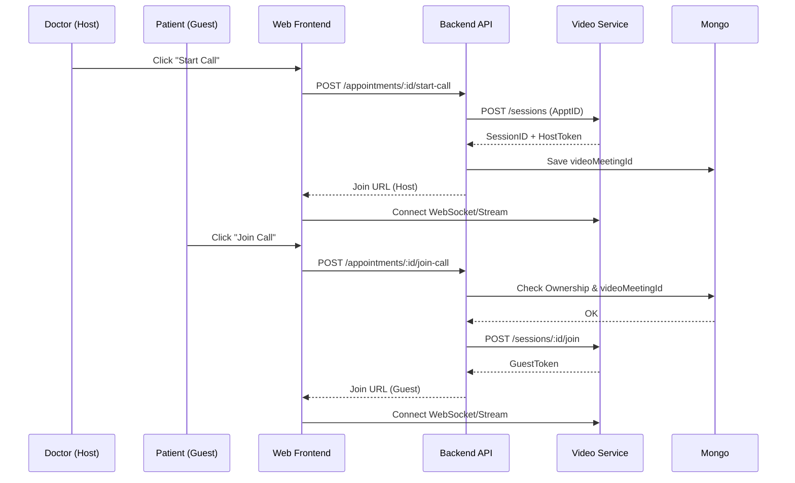
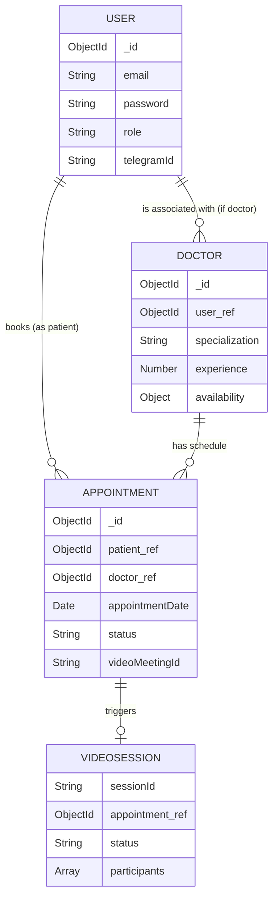
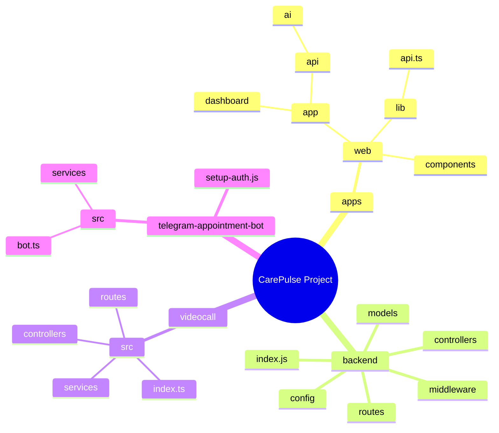
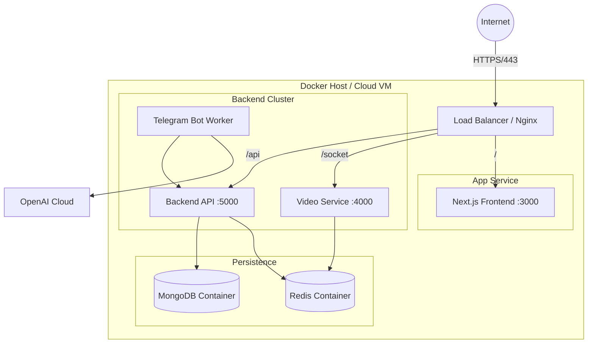

```mermaid
flowchart TD
    subgraph ClientLayer [Clients]
        WebClient[Web App (Next.js)]
        TelegramClient[Telegram App]
    end

    subgraph ServiceLayer [Microservices]
        API_GW[Backend API (Express)]
        VideoSvc[Video Service]
        AISvc[AI Service (Next.js/API)]
        BotSvc[Telegram Bot Service]
    end

    subgraph DataLayer [Data & Infra]
        MongoDB[(MongoDB)]
        Redis[(Redis)]
    end

    subgraph ExternalServices [External]
        OpenAI[OpenAI API]
        SFU[Video SFU/WebRTC]
    end

    WebClient -->|HTTP/REST| API_GW
    WebClient -->|WS/WebRTC| VideoSvc
    WebClient -->|HTTP| AISvc
    TelegramClient -->|Messages| BotSvc

    API_GW --> MongoDB
    API_GW --> Redis
    
    BotSvc -->|Internal HTTP| API_GW
    BotSvc --> Redis
    BotSvc -->|HTTP| OpenAI

    VideoSvc -->|Internal HTTP| API_GW
    VideoSvc --> SFU

    AISvc -->|HTTP| OpenAI
    AISvc -->|Context| MongoDB
```














