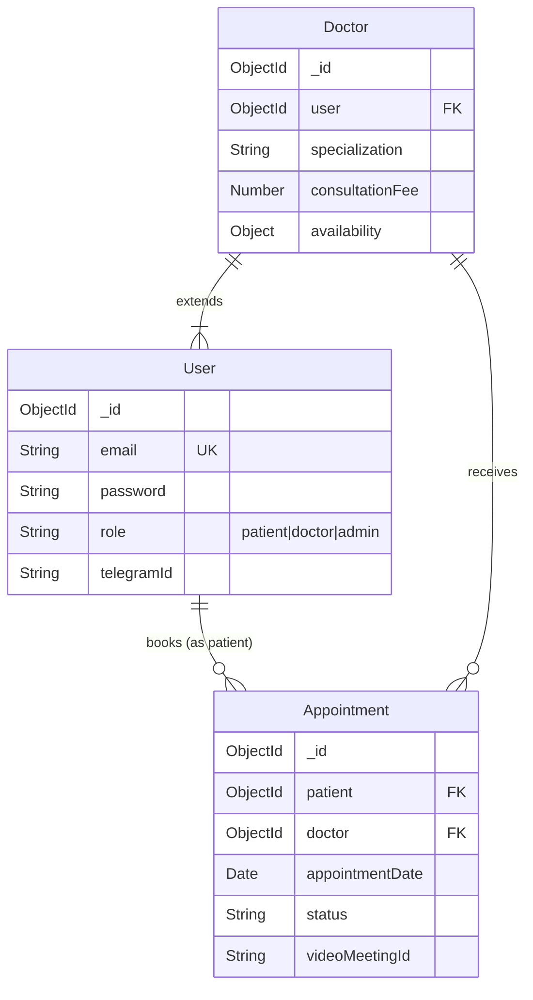

# Database Design Document - CarePulse

**Database System:** MongoDB (v5.0+)
**ODM:** Mongoose (Node.js)

This document details the data models, schema definitions, indexing strategies, and relationships used in the CarePulse platform.

## 1. Entity-Relationship Diagram



---

## 2. Collections & Schemas

### 2.1. Users Collection (`users`)
Stores authentication data and basic profile information for all roles (patients, doctors, admins).

**Primary Key:** `_id` (ObjectId)

| Field | Type | Required | Unique | Description |
| :--- | :--- | :--- | :--- | :--- |
| `email` | String | Yes | **Yes** | User's email address (login credential). |
| `password` | String | Yes | No | Bcrypt-hashed password. |
| `name` | String | No | No | Full display name. |
| `role` | String | Yes | No | Enum: `'patient'`, `'doctor'`, `'admin'`. Default: `'patient'`. |
| `phoneNumber` | String | No | No | Contact number. |
| `profilePicture`| String | No | No | URL to profile image. |
| `dateOfBirth` | Date | No | No | Patient DOB. |
| `address` | Object | No | No | Nested object: `{ street, city, state, zipCode, country }`. |
| `telegramId` | String | No | No | Linked Telegram User ID for bot interaction. |
| `refreshToken` | String | No | No | JWT Refresh Token for session management. |
| `createdAt` | Date | - | - | Timestamp (Auto-generated). |
| `updatedAt` | Date | - | - | Timestamp (Auto-generated). |

**Indexes:**
*   `{ email: 1 }` (Unique)

---

### 2.2. Doctors Collection (`doctors`)
Stores extended profile information for users who have the role of doctor. This is a one-to-one relationship with the `User` collection (via `user` field).

**Primary Key:** `_id` (ObjectId)

| Field | Type | Required | Description |
| :--- | :--- | :--- | :--- |
| `user` | ObjectId | Yes | Reference to `User` collection. |
| `specialization` | String | Yes | Medical specialization (e.g., "Cardiologist"). |
| `experience` | Number | Yes | Years of experience. |
| `consultationFee`| Number | Yes | Fee per session. |
| `bio` | String | No | Short biography/description. |
| `rating` | Object | No | `{ average: Number, totalReviews: Number }`. |
| `isActive` | Boolean | No | Default: `true`. Controls visibility. |
| `videoCallEnabled`| Boolean| No | Default: `true`. |
| `qualifications` | Array | No | List of objects: `{ degree, institution, year }`. |
| `availability` | Object | No | Nested object defining weekly slots (see below). |

**Availability Schema Structure:**
```javascript
{
  "monday": { "available": Boolean, "startTime": "HH:mm", "endTime": "HH:mm" },
  "tuesday": { ... },
  ...
  "sunday": { ... }
}
```

**Indexes:**
*   `{ specialization: 1 }` - For filtering doctors by category.
*   `{ user: 1 }` - Fast lookup of doctor profile by user ID.

---

### 2.3. Appointments Collection (`appointments`)
Stores booking records linking a Patient (User) and a Doctor.

**Primary Key:** `_id` (ObjectId)

| Field | Type | Required | Default | Description |
| :--- | :--- | :--- | :--- | :--- |
| `patient` | ObjectId | Yes | - | Reference to `User` collection (Role: patient). |
| `doctor` | ObjectId | Yes | - | Reference to `Doctor` collection. |
| `appointmentDate`| Date | Yes | - | The date of the appointment. |
| `appointmentTime`| String | Yes | - | The time slot (e.g., "14:30"). |
| `reason` | String | Yes | - | Reason for visit. |
| `status` | String | Yes | `'pending'` | Enum: `'pending', 'scheduled', 'completed', 'cancelled'`. |
| `videoMeetingId` | String | No | `null` | Session ID for the video call service. |
| `videoCallLink` | String | No | `null` | Full URL for the video call (cached). |
| `videoProvider` | String | No | `'internal'`| Enum: `'internal', 'livekit', 'twilio'`. |
| `prescription` | String | No | - | Text content of prescription (if added). |
| `notes` | String | No | - | Doctor's private notes. |
| `createdAt` | Date | - | - | Timestamp. |

**Indexes:**
*   `{ doctor: 1, appointmentDate: -1 }` - For retrieving a doctor's schedule efficiently.
*   `{ patient: 1, appointmentDate: -1 }` - For retrieving a patient's history.
*   `{ status: 1 }` - For filtering by status (e.g., pending requests).

---

## 3. Relationships & Data Integrity

1.  **User -> Doctor (1:1):**
    *   A `User` document stores login creds.
    *   A `Doctor` document holds the professional details and references the `User._id`.
    *   **Application Logic:** When creating a doctor (Admin action), a User is created first, then the specific Doctor document is linked.

2.  **Patient -> Appointment (1:N):**
    *   One Patient User can have multiple Appointments.
    *   The `Appointment` document holds a `patient` field referencing `User._id`.

3.  **Doctor -> Appointment (1:N):**
    *   One Doctor can have multiple Appointments.
    *   The `Appointment` document holds a `doctor` field referencing `Doctor._id`.

4.  **Populating Data:**
    *   `appointmentSchema.pre(/^find/, ...)` middleware is configured to automatically populate:
        *   `patient` (name, email, profilePicture)
        *   `doctor` -> `user` (name, email, profilePicture)
    *   This ensures that fetching an appointment always yields the necessary display names for the frontend without manual aggregation.
