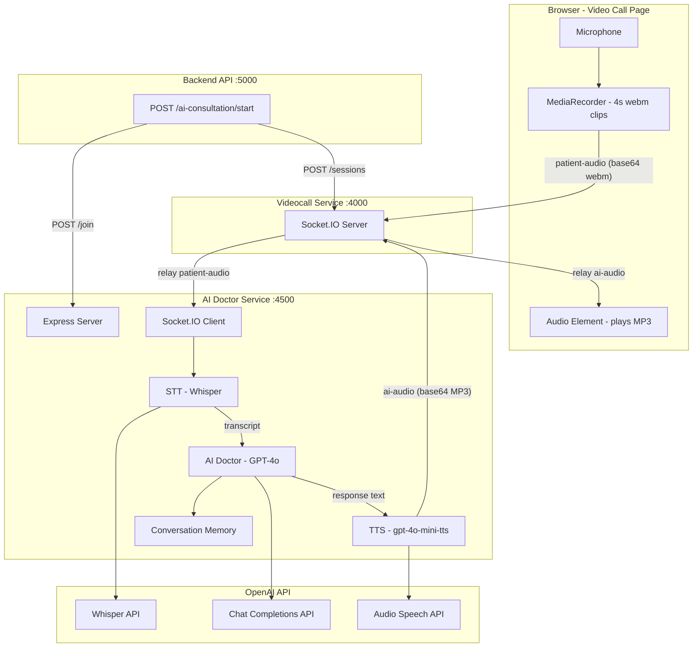
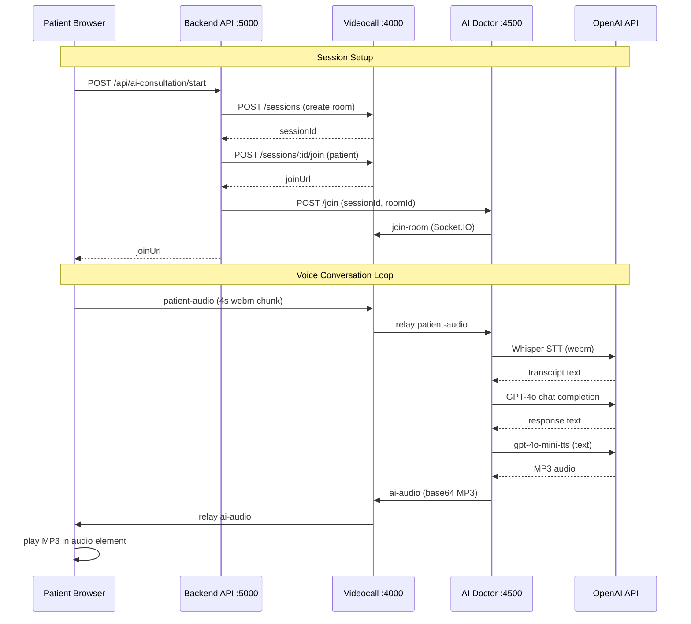

# AI Doctor Service

A real-time voice-based AI doctor microservice for the **CarePulse** telemedicine platform. The AI doctor joins a video call room as a virtual participant, listens to the patient's speech, and responds with AI-generated voice — creating a hands-free telemedicine consultation experience.

---

## Table of Contents

- [Overview](#overview)
- [Architecture](#architecture)
- [End-to-End Flow](#end-to-end-flow)
- [Audio Pipeline](#audio-pipeline)
- [OpenAI Models Used](#openai-models-used)
- [Module Reference](#module-reference)
- [Integration Points](#integration-points)
- [Environment Variables](#environment-variables)
- [Getting Started](#getting-started)
- [API Endpoints](#api-endpoints)
- [Socket Events](#socket-events)

---

## Overview

The AI Doctor Service is a Node.js + TypeScript + Express microservice that acts as an **AI-powered doctor** inside a video call. Instead of a human doctor, the patient talks to an AI that:

1. **Listens** to the patient's voice (via audio chunks sent over Socket.IO)
2. **Transcribes** speech to text (OpenAI Whisper)
3. **Generates** a medically-guided response (OpenAI GPT-4o)
4. **Synthesizes** the response into speech (OpenAI gpt-4o-mini-tts)
5. **Sends** the audio back to the patient in real time

The service maintains per-session conversation memory so the AI doctor remembers context throughout the consultation.

---

## Architecture





---

## End-to-End Flow

### 1. Patient clicks "Join call with AI Doctor" on the dashboard

The frontend calls `POST /api/ai-consultation/start` on the backend.

### 2. Backend orchestrates session creation

- Creates a video session via the videocall service (`POST /sessions`) with `doctorId: "ai-doctor"`.
- Gets a patient join URL (`POST /sessions/:id/join`).
- Tells the AI doctor service to join the room (`POST /join` on port 4500).
- Returns the join URL (with `aiConsultation=true`) to the frontend.

### 3. Patient opens the video call page

- The page detects `aiConsultation=true` and enters AI mode.
- Shows an **AI avatar** in the remote slot instead of a webcam feed.
- Starts recording the mic in **4-second webm clips** using `MediaRecorder`.
- Each clip is a complete, valid webm file (not a fragment).

### 4. AI doctor processes each clip

For every `patient-audio` event received:

| Step | Module | OpenAI Model | Input | Output |
|------|--------|-------------|-------|--------|
| **STT** | `stt.ts` | `whisper-1` | 4s webm audio | English transcript |
| **AI** | `aiDoctor.ts` | `gpt-4o` | Transcript + conversation history | Doctor response text |
| **TTS** | `tts.ts` | `gpt-4o-mini-tts` | Response text | MP3 audio buffer |

### 5. Patient hears the AI doctor

The MP3 buffer is base64-encoded and emitted as `ai-audio` back through the videocall signaling server. The patient's browser decodes it and plays it through a hidden `<audio>` element.

---

## Audio Pipeline

```
Patient speaks
    │
    ▼
Browser MediaRecorder (4s webm/opus clips)
    │
    ▼  socket.emit('patient-audio', { audio: base64 })
    │
Videocall Signaling Server (relay)
    │
    ▼  socket.on('patient-audio')
    │
AI Doctor Service
    │
    ├─► STT: transcribeAudio(buffer)         → whisper-1    → "I have a headache"
    │
    ├─► AI:  generateDoctorResponse(id, text) → gpt-4o      → "How long have you had..."
    │
    ├─► TTS: generateSpeech(response)         → gpt-4o-mini-tts → <MP3 buffer>
    │
    ▼  socket.emit('ai-audio', { roomId, audio: base64 })
    │
Videocall Signaling Server (broadcast)
    │
    ▼  socket.on('ai-audio')
    │
Browser <audio> element plays MP3
```

**Concurrency handling**: Only one chunk is processed at a time. If a new chunk arrives while one is in-flight, it is queued (`pendingPayload`) and processed immediately after the current one finishes.

---

## OpenAI Models Used

| Model | Purpose | Module | Details |
|-------|---------|--------|---------|
| **whisper-1** | Speech-to-Text | `stt.ts` | Transcribes patient's webm audio to English text. `language: 'en'` is set to force English transcription. |
| **gpt-4o** | AI Doctor Chat | `aiDoctor.ts` | Generates contextual doctor responses. Uses a medical system prompt with safety guardrails. Maintains conversation history (last 20 messages) per session. |
| **gpt-4o-mini-tts** | Text-to-Speech | `tts.ts` | Converts the doctor's text response to natural speech (MP3). Uses the `alloy` voice by default. |

### System Prompt

```
You are an AI doctor conducting telemedicine consultation. Ask follow-up
questions and provide safe guidance. Never give dangerous medical
instructions. Always respond in English only, regardless of the language
the patient uses.
```

---

## Module Reference

```
ai-doctor-service/
├── src/
│   ├── server.ts             Express server, /health, POST /join
│   ├── socket.ts             Socket.IO client, joins videocall rooms,
│   │                         handles patient-audio → STT → AI → TTS → ai-audio
│   ├── openai.ts             Shared OpenAI SDK client (from OPENAI_API_KEY)
│   ├── stt.ts                transcribeAudio(buffer) → text (Whisper)
│   ├── aiDoctor.ts           generateDoctorResponse(sessionId, text) → text (GPT-4o)
│   ├── tts.ts                generateSpeech(text) → Buffer (gpt-4o-mini-tts)
│   ├── conversationMemory.ts In-memory chat history per session (max 20 msgs)
│   └── audioProcessor.ts     Convenience pipeline: audio → STT → AI → TTS → audio
├── package.json
├── tsconfig.json
├── .env.example
└── README.md
```

| Module | Exports | Description |
|--------|---------|-------------|
| `server.ts` | Express app | HTTP server on port 4500. Health check and `/join` endpoint. |
| `socket.ts` | `joinRoom(sessionId, roomId)`, `disconnect()` | Connects to videocall signaling server as a Socket.IO client. Joins room, listens for `patient-audio`, runs pipeline, emits `ai-audio`. |
| `openai.ts` | `openai`, `isOpenAIConfigured()` | Singleton OpenAI client initialized from `OPENAI_API_KEY`. |
| `stt.ts` | `transcribeAudio(buffer): Promise<string>` | Sends audio to Whisper API, returns English transcript. |
| `aiDoctor.ts` | `generateDoctorResponse(sessionId, text): Promise<string>` | Adds user message to memory, calls GPT-4o with history, stores and returns response. |
| `tts.ts` | `generateSpeech(text): Promise<Buffer>` | Calls gpt-4o-mini-tts, returns MP3 buffer. |
| `conversationMemory.ts` | `addUserMessage()`, `addAssistantMessage()`, `getConversation()` | In-memory `Map<sessionId, ChatMessage[]>`, capped at 20 messages. |
| `audioProcessor.ts` | `processAudio(sessionId, buffer): Promise<Buffer>` | Full pipeline with timing logs. |

---

## Integration Points

### 1. Backend API (port 5000)

The backend has a route `POST /api/ai-consultation/start` that:

- Creates a video session via the videocall service
- Gets the patient's join URL
- Calls `POST http://localhost:4500/join` to tell this service to join the room
- Returns the join URL to the frontend

**Environment variable on backend**: `AI_DOCTOR_SERVICE_URL` (default `http://localhost:4500`).

### 2. Videocall Service (port 4000)

The videocall signaling server (Socket.IO) relays two custom events:

| Event | Direction | Payload |
|-------|-----------|---------|
| `patient-audio` | Patient browser → server → AI doctor | `{ audio: "<base64 webm>" }` |
| `ai-audio` | AI doctor → server → patient browser | `{ roomId, audio: "<base64 MP3>" }` (server broadcasts just the audio string) |

The AI doctor service connects as a **Socket.IO client** (not a server) and joins the room like any other participant using `join-room`.

### 3. Frontend (port 3000)

The Next.js dashboard has a "Talk to AI Doctor" card. When clicked:

1. Calls `POST /api/ai-consultation/start`
2. Opens the returned `joinUrl` in a new tab
3. The video call page detects `aiConsultation=true` in the URL
4. Shows AI avatar, starts mic recording, listens for `ai-audio`

---

## Environment Variables

Create a `.env` file in the `ai-doctor-service/` folder:

```env
# Port (default: 4500)
PORT=4500

# Videocall signaling server (for AI doctor to join rooms)
VIDEOCALL_URL=http://localhost:4000

# OpenAI API key (for chat, STT, TTS)
OPENAI_API_KEY=sk-...
```

---

## Getting Started

```bash
# Install dependencies
cd ai-doctor-service
npm install

# Create .env from example
cp .env.example .env
# Edit .env and add your OPENAI_API_KEY

# Development (hot reload)
npm run dev

# Production build
npm run build
npm start

# Type check
npm run type-check
```

**Prerequisites**: Node.js 20+, the videocall service running on port 4000, and the backend running on port 5000.

---

## API Endpoints

| Method | Path | Description | Body |
|--------|------|-------------|------|
| `GET` | `/health` | Health check | - |
| `POST` | `/join` | Tell AI doctor to join a video room | `{ "sessionId": "...", "roomId": "..." }` |

### POST /join

**Request:**
```json
{
  "sessionId": "4c2d4c55-0cba-40cb-ad3f-487aae34ac20",
  "roomId": "4c2d4c55-0cba-40cb-ad3f-487aae34ac20"
}
```

**Response (200):**
```json
{
  "success": true,
  "message": "AI doctor joining room"
}
```

**Response (400):**
```json
{
  "success": false,
  "message": "sessionId and roomId required"
}
```

---

## Socket Events

Events handled by the AI doctor as a Socket.IO **client** connected to the videocall server:

| Event | Direction | Description |
|-------|-----------|-------------|
| `join-room` | AI doctor → server | Joins the room with userId `ai-doctor-{sessionId}` |
| `patient-audio` | server → AI doctor | Receives patient's audio chunk, triggers pipeline |
| `ai-audio` | AI doctor → server | Sends back AI response audio for broadcast to room |
